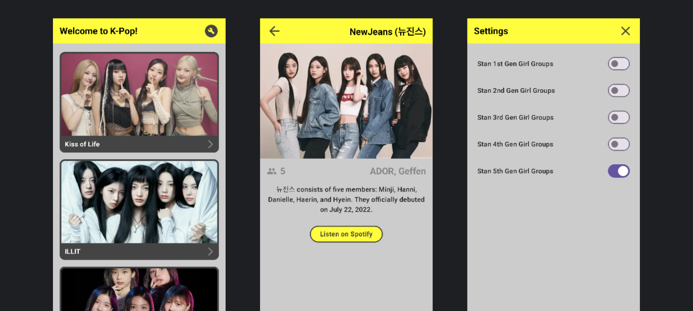
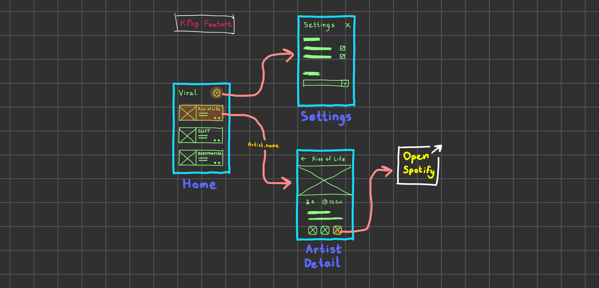

<h1 align="center">K-Pop : Compose Navigation Example</h1>

> [!TIP]
> อ่านบทความได้ที่นี่ [Navigation ใน Jetpack Compose แบบ Basic สุด ๆ](https://medium.com/@5akda)

## Stack & Libraries
- MVVM Architecture
- [Kotlin](https://kotlinlang.org/)
- [Jetpack Compose](https://developer.android.com/develop/ui/compose)
- [Jetpack Navigation](https://developer.android.com/guide/navigation)
- [Hilt](https://dagger.dev/hilt/)

## Graph

